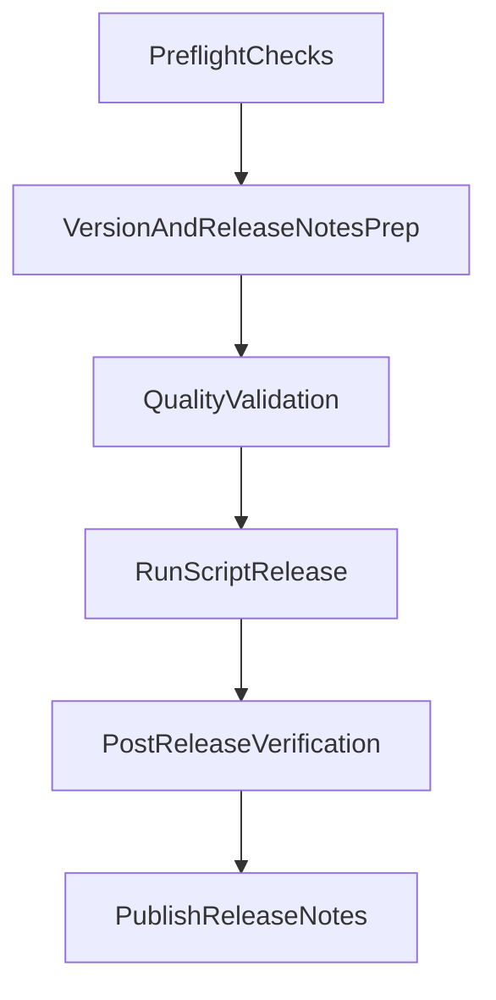

# Major Release Runbook

## Scope

Use the existing release automation in `[/Users/malmstein/dev/repos/asana-github-sync/script/release](/Users/malmstein/dev/repos/asana-github-sync/script/release)` to cut a **major** release, and produce release notes with the template in `[/Users/malmstein/dev/repos/asana-github-sync/.github/prompts/create-release-notes.prompt.md](/Users/malmstein/dev/repos/asana-github-sync/.github/prompts/create-release-notes.prompt.md)`.

Per your preference, `package.json` will use `**vX.X.X` format** for this release (matching script confirmation wording).

## Release Flow

## Steps

- Confirm clean working tree and target branch before release execution; if there are pending changes, decide whether to include or defer.
- Choose the target major tag (for example `v1.0.0`) and update `[/Users/malmstein/dev/repos/asana-github-sync/package.json](/Users/malmstein/dev/repos/asana-github-sync/package.json)` `version` to the exact same `vX.X.X` value.
- Draft release notes from merged changes since the previous release using the template in `[/Users/malmstein/dev/repos/asana-github-sync/.github/prompts/create-release-notes.prompt.md](/Users/malmstein/dev/repos/asana-github-sync/.github/prompts/create-release-notes.prompt.md)`, with a dedicated breaking-changes section for major release impact.
- Run project validation commands (format/lint/tests/bundle as appropriate for this repo) so the release tag points at a verified commit.
- Execute `[/Users/malmstein/dev/repos/asana-github-sync/script/release](/Users/malmstein/dev/repos/asana-github-sync/script/release)`: provide the new tag when prompted, confirm version alignment, and let it create/push `vX.X.X`, `vX`, and `releases/vX` (for a major release).
- Verify remote results: tags exist and point to expected commit, `releases/vX` branch exists, and release notes are published in the release entry.

## Notes / Risk Checks

- The script force-updates the major tag for non-major releases; for this major release it should create a fresh major tag and branch.
- If this is the first tag in the repository, the script path handles it as first major release automatically.
- Keep the release commit atomic (version + any final docs/changelog updates) to simplify rollback/audit.

## Key Files

- `[/Users/malmstein/dev/repos/asana-github-sync/script/release](/Users/malmstein/dev/repos/asana-github-sync/script/release)`
- `[/Users/malmstein/dev/repos/asana-github-sync/package.json](/Users/malmstein/dev/repos/asana-github-sync/package.json)`
- `[/Users/malmstein/dev/repos/asana-github-sync/.github/prompts/create-release-notes.prompt.md](/Users/malmstein/dev/repos/asana-github-sync/.github/prompts/create-release-notes.prompt.md)`

